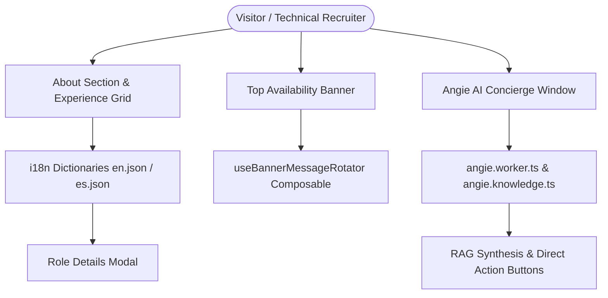

# Technical Design: BITS Americas Solutions Architect Level II Integration

## Technical Approach

Integrate César Gómez's career milestone as **Arquitecto de Soluciones Frontend Nivel II** at **BITS Americas S.A.S.** across the portfolio experience timeline, top availability banner, and Angie AI concierge knowledge retrieval system, maintaining 100% bilingual parity and strict type safety.

---

## Architecture Decisions

### Decision 1: Experience Timeline Entry & Company Representation

- **Choice**: Add `bitsamericas` to `about.roles` in `i18n/locales/en.json` and `i18n/locales/es.json`, prepend `{ key: 'bitsamericas' }` in `AboutSection.vue`, and configure `COMPANY_LOGOS.bitsamericas` with SVG/PNG asset or graceful text badge fallback.
- **Alternatives considered**: Merging BITS Americas into existing consultation roles or adding an external modal.
- **Rationale**: Follows the established design pattern of interactive experience cards in `AboutSection.vue` with modal inspection of key architectural deliverables.

### Decision 2: Top Banner Availability & Positioning Alignment

- **Choice**: Keep `availability.banner` messages synchronized with current engagement status ("Open to new opportunities" / "Abierto a nuevas oportunidades") without flipping `availableFrom` to a rigid future date until formal contract signing.
- **Alternatives considered**: Hiding the top banner entirely or marking unavailable immediately.
- **Rationale**: Respects the user's explicit directive to keep the hiring funnel active and responsive while highlighting recent architectural selection.

### Decision 3: Angie AI Knowledge Retrieval & Entity Alignment

- **Choice**: Introduce a high-confidence node `company_bits_americas` in `app/config/angie.knowledge.ts` and update `companies_experience` to list BITS Americas S.A.S.
- **Alternatives considered**: Relying on generic bio summary fallback.
- **Rationale**: Guarantees deterministic, instant intent matching when recruiters or technical leaders ask about BITS Americas or Design Systems architecture.

---

## Component & Data Flow

---

## File Changes & Structure

| File                                       | Type     | Description                                                                 |
| ------------------------------------------ | -------- | --------------------------------------------------------------------------- |
| `i18n/locales/en.json`                     | Modified | Add `about.roles.bitsamericas` with title, company, years, desc, highlights |
| `i18n/locales/es.json`                     | Modified | Add `about.roles.bitsamericas` in Spanish with 100% key parity              |
| `app/components/sections/AboutSection.vue` | Modified | Add `bitsamericas` to `roles` array and `COMPANY_LOGOS`                     |
| `app/config/angie.knowledge.ts`            | Modified | Add `company_bits_americas` node and update `companies_experience`          |
| `tests/unit/angieRetriever.spec.ts`        | Modified | Add unit tests for BITS Americas query retrieval                            |

---

## Threat Matrix

| Threat Category                    | Applicability | Mitigation & Test Strategy                          |
| ---------------------------------- | ------------- | --------------------------------------------------- |
| Injection / Unsanitized Input      | N/A           | Static i18n dictionaries and sanitized chat strings |
| Remote Code / Subprocess Execution | N/A           | Pure client-side static SSG application             |
| CSP Violations                     | Applicable    | No inline JS handlers; icons bundled offline        |

---

## Testing & Verification Plan

1. **Unit & Retriever Tests**:
   - `tests/unit/angieRetriever.spec.ts`: Verify `searchKnowledge('Tell me about BITS Americas', 'en')` and Spanish equivalents match `company_bits_americas`.
2. **Pre-push Quality Suite**:
   - `pnpm format:check`
   - `pnpm lint` & `pnpm typecheck`
   - `pnpm test:coverage` (177+ specs passing with >= 80% coverage)
